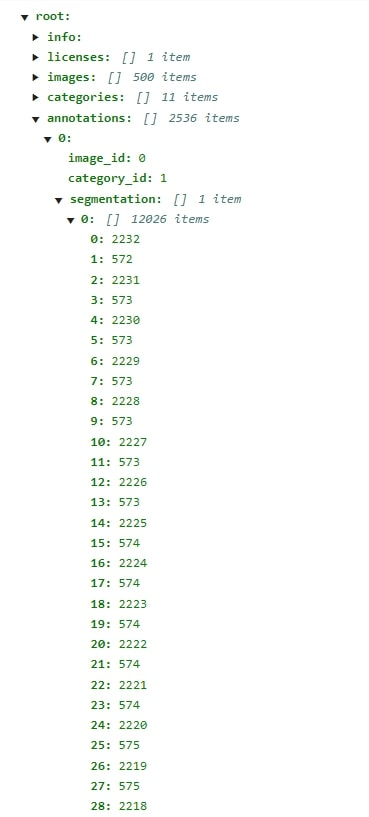

This dataset is created by NAVER Connect Foundation.

# Recycle Trash Dataset

<br>
 
## Overview


Recycle Trash Dataset is a dataset that collects **indoor and outdoor** garbage photos.  
It consists of **21818 photos and annotation data for 107935 objects**.  
Each object has a **bounding box and segmentation** data and the compressed dataset is about **120 GB** in size.

<br>

## Contents
1. Labels
2. Samples
3. Dataset Structure
4. License

<br>

## 1. Labels
Each class is labeled according to standard recycling classification criteria.

| Class Name | Object Count | Ratio |
| :---: | :---: | :---: |
General trash | 18117 | 16.79%
Metal | 4451 | 4.12%
Plastic bag | 23805 | 22.05%
Glass | 4142 | 3.84%
Plastic | 14098 | 13.06%
Styrofoam | 5627 | 5.21%
Paper | 29873 | 27.68%
Clothing | 2091 | 1.94%
Paper pack | 4235 | 3.92%
Battery | 738 | 0.68%
UNKNOWN | 758 | 0.7%
--- | --- | ---
Total | 107935 | 100%

<br>

## 2. Samples

### General trash


### Metal


### Plastic bag


### Glass


### Plastic


### Styrofoam


### Paper


### Clothing


### Paper pack


### Battery


<br>

## 3. Dataset Structure

### 1) Directory Structure
Each batch consists of 500 pictures and is randomly sampled over the entire data.  
There is one json file in each batch and the annotation information is stored. 2 types of folder is provided.
1. **data folder** : original image size dataset for training.
2. **vis (visualization) folder** : vis folder is a visualization of the information in the json file and displays the bounding box and segmentation on the image that has been resized to 1080px in height. (only for preview purpose)
```
trash_dataset
├── data
│   ├── batch_01
│   │   ├── 0000.jpg
│   │   ├── 0001.jpg
│   │   ├── ...
│   │   ├── 0499.jpg
│   │   └── data.json
│   ├── batch_02
│   │   ├── 0000.jpg
│   │   ├── 0001.jpg
│   │   ├── ...
│   │   ├── 0499.jpg
│   │   └── data.json
│   ├── ...
│   ├── batch_44
│   │   ├── 0000.jpg
│   │   ├── 0001.jpg
│   │   ├── ...
│   │   ├── 0317.jpg
│   │   └── data.json

├── vis
│   ├── batch_01
│   │   ├── 0000.jpg
│   │   ├── 0001.jpg
│   │   ├── ...
│   │   ├── 0499.jpg
│   ├── batch_02
│   │   ├── 0000.jpg
│   │   ├── 0001.jpg
│   │   ├── ...
│   │   ├── 0499.jpg
│   ├── ...
│   ├── batch_44
│   │   ├── 0000.jpg
│   │   ├── 0001.jpg
│   │   ├── ...
│   │   ├── 0317.jpg
```

### 2) Json File Structure
For convenience, annotations are provided in COCO format.  
Please check out the youtube video https://www.youtube.com/watch?v=h6s61a_pqfM


```iscrowd``` variable is for surface masking using rle decode, but it is not used.


Segmentation points are in the form of x1, y1, x2, y2, x3, y3, ...,  
and since one object may be divided into several, one object may be divided into several polygons.



<br>

## 4. License
This work is licensed under a <a rel="license" href="http://creativecommons.org/licenses/by/4.0/">Creative Commons Attribution 4.0 International License</a>.<br />
<a rel="license" href="http://creativecommons.org/licenses/by/4.0/"></a><br />
